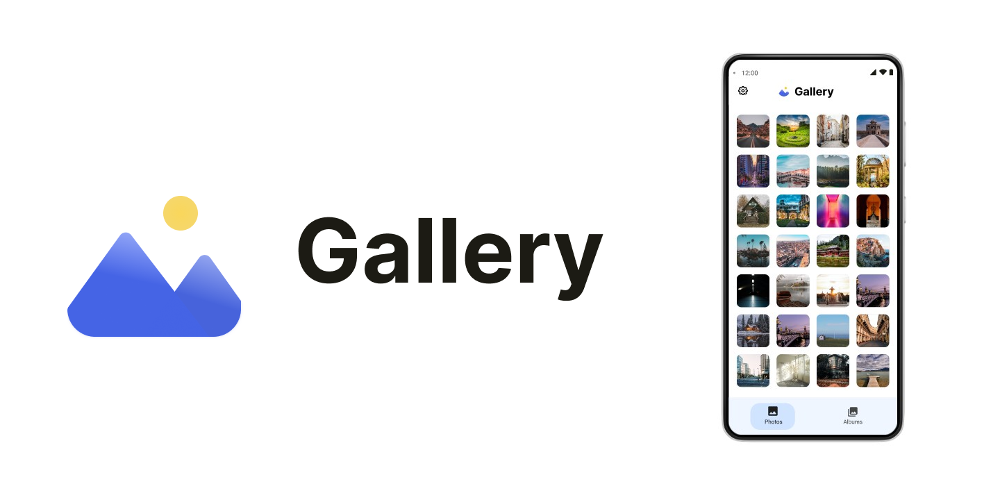

# Gallery

 

  

## About

Gallery is an open source application designed to provide a simple and efficient image viewing experience on your Android device. With Gallery, you can organize and browse your photos and videos intuitively and quickly.

Some of Gallery's features include:

* Intuitive and easy-to-use user interface.
Ability to view and organize your photos and videos in folders.
* Ability to easily share your images through social networking and messaging applications. 

*Thank you for choosing Gallery!*

 

**Disclaimer**

Please note that Gallery is currently in beta!

While we have done our best to ensure that Gallery is a solid and reliable application, you may encounter some bugs or issues while using it. Please note that this is normal for a beta application.

If you encounter any bugs or issues while using Gallery, we invite you to report them in the issues section of our GitHub repository. This way, we can work on fixing it and make the app even better.

We would also love for you to help us improve Gallery. If you are a developer and would like to contribute to the development of the app, you are more than welcome! Check out our repository on GitHub for more information on how you can contribute.

Thank you for your understanding and for helping us make Gallery an even better app!

 

**Donate**

     